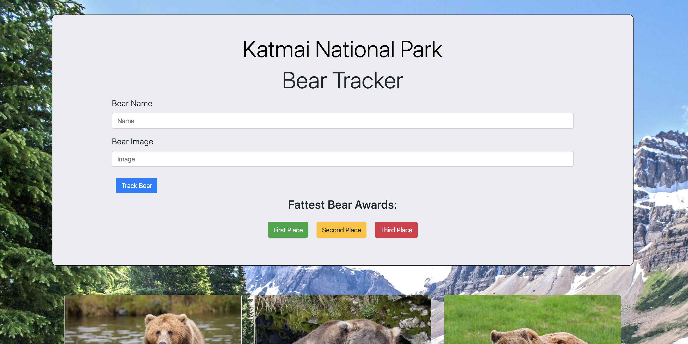

# bear-watcher

## Description
This project allows the user to input information about a bear they want to track.  When the page loads, the user will see a form that asks the user to input a bear name and an image url of the bear.  The user can then click a submit button that will print a card with the bear's details on the page.  The cards include two buttons: one that allows the user to pull up additional info about a single bear, and a "fish catch event" button that triggers and records an attempt by the bear to catch a fish, whether successful or not.  When the info button is clicked a modal will appear and showcase each instance of a catch attempt, including whether or not it was successful, and a time stamp.  The single bear modal will also show the bear's catch percentage.  Also in the form, the user will be able to click one of three buttons (First Place, Second Place, Third Place) that will sort the array of bears based on their catch percentage, and pull up a modal displaying either the first, second, or third place bear, with respect to which of those buttons was clicked.  This project is an opportunity to exercise and gain understanding of basic JS Modules.
## Screenshots

## How To Run
1. Clone down this repository.
2. Make sure you have http-server installed via npm.  If not get it [HERE](https://www.npmjs.com/package/http-server)
3. On the command line, run `hs -p 8080`.
4. In your browser, to go `http://localhost:8080`.